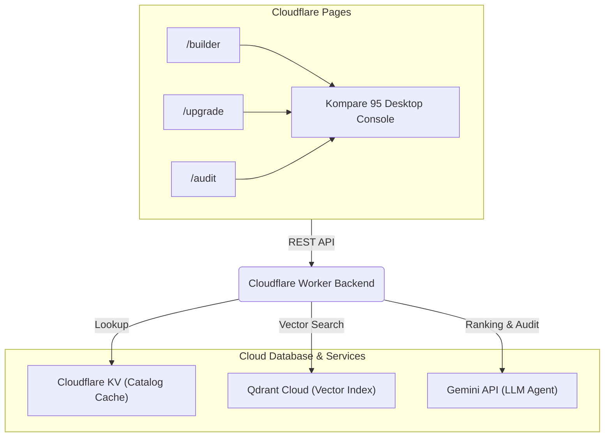

<div align="center">
  <h1>Kompare</h1>
  <p><strong>AI-Powered Smart Shopping Assistant & Product Decision Engine for PC Builders</strong></p>
</div>

<br />

**Kompare** is your intelligent companion for PC building and upgrading in Indonesia. We keep the focus on practical builder workflows: whether you're assembling a balanced PC from a budget, upgrading an existing rig, auditing a cart or parts list, or asking grounded follow-up questions about the active recommendation, Kompare has you covered.

Built with a fast **Next.js (App Router)** frontend deployed on **Cloudflare Pages** and a serverless **Cloudflare Worker** backend, Kompare uses a curated component catalog (cached in Cloudflare KV) for deterministic recommendations, compatibility checks, and AI-assisted decision-making powered by Gemini or Local LLMs.

---

## Screenshot


---

## Core AI Features

Kompare features an intelligent shopping and decision engine for PC building:

- **Context Engineering**: Recommendations are grounded in component compatibility rules, budget constraints, and user-specified use cases.
- **Multimodal AI (Image + Text)**: The `/audit` flow allows users to upload a screenshot of their cart or a parts list for compatibility verification.
- **Context Pruning**: Large datasets are pruned and extracted so only relevant specs and components are fed to the reasoning engine.
- **Conversational Assistant with Memory**: The **PC Build Advisor** maintains multi-turn context to answer detailed follow-up questions about the active build or upgrade.
- **Structured Outputs**: Prompts enforce structured JSON responses that drive deterministic UI renders.

---

## Key Features

| Page / Flow | Description |
|---|---|
| **Desktop Console** | Kompare 95 shell with compact navigation for builder, upgrade, and audit workflows. |
| **Build From Zero** | Generates a complete PC tower build including CPU, Motherboard, RAM, GPU, SSD, HDD, PSU, Coolers, and Casing. |
| **Upgrade Existing PC** | Accepts parts you already own and returns compatible upgrade or missing-part recommendations. |
| **Audit a PC Build** | Upload a cart screenshot or pasted parts list to flag compatibility risks before buying. |
| **PC Build Advisor** | Answers grounded follow-up questions about the active build or upgrade result. |
| **Budget Tiers** | Presents entry-level, mid-range, high-end, and custom-budget guidance. |
| **Marketplace Links** | Links recommended components directly to EnterKomputer (when product URLs are available). |
| **Optional Add-ons** | Suggests monitors and UPS as optional setup recommendations for full first-time builds. |

---

## Architecture



> **Note:** The backend uses Cloudflare Workers AI for query embeddings, Qdrant Cloud for vector searches, and Google Gemini API (with key rotation) for build reasoning. Deterministic compatibility checks always run on the Edge Worker to validate candidate parts.

---

## Tech Stack

- **Backend**: Cloudflare Worker (JavaScript ES Modules, Wrangler CLI)
- **Frontend**: Next.js App Router, React 19, Zustand
- **Vector DB**: Qdrant Cloud (Managed)
- **AI**: Cloudflare Workers AI (bge embeddings), Google Gemini API (key rotation)
- **Data**: Cloudflare KV (component catalog)
- **Market**: Indonesia, IDR pricing, id-ID formatting

---

## Quick Start Guide

Follow these steps to get your Kompare development environment up and running.

### 1. Installation

Install the required dependencies for the Next.js frontend and standalone Worker.

```powershell
# Install Next.js frontend dependencies
cd frontend
npm install
cd ..

# Install Worker backend dependencies
cd backend_worker
npm install
cd ..
```

### 2. Configure Local Worker Secrets

Keep local Worker secrets in the gitignored `backend_worker/.dev.vars` file or
your local environment. Never commit `.dev.vars`, `.env`, credentials, or API
key values. The local file may define:

* `QDRANT_URL` & `QDRANT_API_KEY` (Qdrant Cloud endpoint & access key)
* `GEMINI_API_KEY` (along with `GEMINI_API_KEY_1` to `GEMINI_API_KEY_4` rotation keys)

### 3. Deploy and Set Secrets on Cloudflare Workers

Secrets must be registered in Cloudflare Workers securely via Wrangler so they are not committed to Git:

```powershell
# Wrangler prompts for each value without placing it in shell history.
npx wrangler secret put QDRANT_API_KEY --cwd backend_worker

# Set Gemini API key rotation pool
npx wrangler secret put GEMINI_API_KEY --cwd backend_worker
npx wrangler secret put GEMINI_API_KEY_1 --cwd backend_worker
npx wrangler secret put GEMINI_API_KEY_2 --cwd backend_worker
npx wrangler secret put GEMINI_API_KEY_3 --cwd backend_worker
npx wrangler secret put GEMINI_API_KEY_4 --cwd backend_worker
```

Deploy the Worker to production:
```powershell
npx wrangler deploy --cwd backend_worker
```

### 4. Running the Application Locally

Run the Next.js frontend development server locally:

```powershell
cd frontend
npm run dev
```

*Note: By default, the local frontend will use the environment variable `NEXT_PUBLIC_API_BASE_URL` to route API calls to the deployed Cloudflare Worker.*

---

## API Surface

All API endpoints are hosted at `/api/...` on the Edge Worker:

| Route | Method | Description |
|---|---|---|
| `/health` | `GET` | Liveness, catalog counts, and KV cache status |
| `/components` | `GET` | Catalog retrieval with search, category, and price filtering |
| `/build/use-cases` | `GET` | Budget allocation weights per use case |
| `/build/budget-tiers` | `GET` | Guided budget tier suggestions |
| `/build/recommend` | `POST` | Deterministic PC build recommendation generator |
| `/build/upgrade` | `POST` | Compatible upgrade suggestions from existing parts |
| `/build/swap-candidates` | `POST` | Find compatible replacement parts for a component slot |
| `/build/swap` | `POST` | Hot-swap component slot and recalculate overall compatibility |
| `/build/ai-recommend` | `POST` | AI-assisted PC build recommendation (Qdrant + Workers AI + Gemini) |
| `/build/audit` | `POST` | Audit screenshot or pasted parts lists for compatibility checks |
| `/build/advisor` | `POST` | Grounded multi-turn conversational build advisor |

---

## Testing

Run tests across the frontend using the following commands:

```powershell
# Run frontend unit/integration tests
cd frontend
npm run test

# Run UI flow tests (Playwright)
npm run test:ui

# Verify Next.js production build
npm run build
```

---

## Documentation

Version-controlled guides, architecture, product status, and operational
playbooks are indexed in [`docs/README.md`](docs/README.md).
