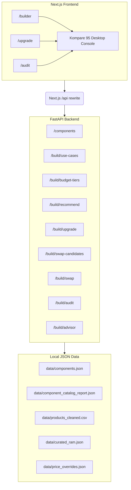

<div align="center">
  <h1>Kompare</h1>
  <p><strong>AI-Powered Smart Shopping Assistant & Product Decision Engine for PC Builders</strong></p>
</div>

<br />

**Kompare** is your intelligent companion for PC building and upgrading in Indonesia. We keep the focus on practical builder workflows: whether you're assembling a balanced PC from a budget, upgrading an existing rig, auditing a cart or parts list, or asking grounded follow-up questions about the active recommendation, Kompare has you covered.

Built with a fast **Next.js (App Router)** frontend and a robust local-first **FastAPI** backend, Kompare uses a curated component catalog for deterministic recommendations, compatibility checks, and AI-assisted decision-making powered by Gemini or Local LLMs.

---

## Screenshot


---

## Capstone AI Features

Kompare fulfills all core capstone requirements for an intelligent shopping assistant:

- **Context Engineering**: Recommendations are grounded in component compatibility rules, budget constraints, and user-specified use cases.
- **Multimodal AI (Image + Text)**: The `/audit` flow allows users to upload a screenshot of their cart or a parts list for compatibility verification.
- **Context Pruning**: Large datasets are pruned and extracted so only relevant specs and components are fed to the reasoning engine.
- **Conversational Assistant with Memory**: The **PC Build Advisor** maintains multi-turn context to answer detailed follow-up questions about the active build or upgrade.
- **Structured Outputs**: Prompts enforce structured JSON responses that drive deterministic UI renders.

---

## Key Features

| Page / Flow | Description |
|---|---|
| **Desktop Console** | Kompare 95 shell with compact navigation for builder, upgrade, and audit workflows. |
| **Build From Zero** | Generates a complete PC tower build including CPU, Motherboard, RAM, GPU, SSD, HDD, PSU, Coolers, and Casing. |
| **Upgrade Existing PC** | Accepts parts you already own and returns compatible upgrade or missing-part recommendations. |
| **Audit a PC Build** | Upload a cart screenshot or pasted parts list to flag compatibility risks before buying. |
| **PC Build Advisor** | Answers grounded follow-up questions about the active build or upgrade result. |
| **Budget Tiers** | Presents entry-level, mid-range, high-end, and custom-budget guidance. |
| **Marketplace Links** | Links recommended components directly to EnterKomputer (when product URLs are available). |
| **Optional Add-ons** | Suggests monitors and UPS as optional setup recommendations for full first-time builds. |

---

## Architecture



> **Note:** The backend can call the Gemini API for focused PC build reasoning where configured. Without Gemini, deterministic compatibility checks, typed-list audit fallback, and advisor fallback still run reliably from local component data.

---

## Tech Stack

- **Backend**: Python, FastAPI, Pydantic, pytest
- **Frontend**: Next.js, React, Playwright, Vitest
- **AI**: Google Gemini API, Local Qwen + Qdrant (Optional)
- **Data**: Local JSON component catalog and EnterKomputer product URLs
- **Market**: Indonesia, IDR pricing, id-ID formatting

---

## Quick Start Guide

Follow these steps to get your Kompare development environment up and running.

### 1. Installation

Install the required dependencies for both the Python backend and the Next.js frontend.

```powershell
# Install Python backend requirements
pip install -r requirements.txt

# Install Next.js frontend requirements
cd frontend
npm install
cd ..
```

### 2. Configure Cloud AI (Gemini API)

To use Google Gemini for AI-assisted recommendations and cart audits:

1. Copy the example environment file:
   ```powershell
   Copy-Item .env.example .env
   ```
2. Open the `.env` file in your text editor and find `GEMINI_API_KEY`.
3. Replace the placeholder with your actual Google Gemini API key. 
   > **Tip:** You can optionally set `GEMINI_API_KEY_1` through `GEMINI_API_KEY_4` to rotate through multiple keys and bypass quota limits.

### 3. Configure Local AI (LM Studio + Qdrant) - *Optional*

If you prefer to run the AI completely locally (without using Gemini), set up the **Local Qwen + Qdrant** profile:

1. **Start Qdrant (Vector Database):** We provide a `docker-compose.yml` file for a hassle-free setup.
   ```powershell
   docker-compose up -d
   ```
2. **Start LM Studio:** 
   - Open LM Studio.
   - Load the `qwen/qwen3.6-27b` model and the `text-embedding-qwen3-embedding-4b` model.
   - Start the **Local Server** (usually runs on port `1234`).
3. **Sync the Database:** Populate the Qdrant database with the PC component catalog by running this script:
   ```powershell
   $env:PYTHONPATH="."
   python backend/utils/qdrant_sync.py --profile local_qwen
   ```

### 4. Run the Application

The easiest way to start the application is using our unified PowerShell script. It automatically boots up the FastAPI backend and Next.js frontend, links them together, and opens your browser.

```powershell
.\dev.ps1
```

> **Note:** The frontend will default to port `5173`. You can stop both servers anytime by pressing `Ctrl+C` in the terminal.

#### Running Manually (Alternative)
If you prefer to run the Next.js frontend directly using its default port (3000):
```powershell
cd frontend
npm run dev
```

---

## API Surface

| Route | Method | Description |
|---|---|---|
| `/health` | `GET` | Liveness and catalog counts |
| `/components` | `GET` | PC component catalog filtered by category, query, and max price |
| `/build/use-cases` | `GET` | Builder use-case profiles and budget allocation weights |
| `/build/budget-tiers` | `GET` | Entry-level, mid-range, high-end, and custom-budget guidance |
| `/build/recommend` | `POST` | Compose a full PC build from budget, use case, and soft brand preferences |
| `/build/upgrade` | `POST` | Accept manually typed existing parts and recommend upgrade or missing components |
| `/build/swap-candidates` | `POST` | List compatible replacement candidates for one component slot |
| `/build/swap` | `POST` | Replace one component slot and re-check compatibility |
| `/build/audit` | `POST` | Audit a cart screenshot and/or typed parts list for compatibility risks |
| `/build/advisor` | `POST` | Ask grounded follow-up questions about a build or upgrade result |

---

## Required Build Slots

A complete build consists of the following components:

- Processor / CPU
- Motherboard
- RAM
- VGA / GPU
- SSD
- Hard Drive / HDD
- PSU
- CPU Cooler
- Fan Cooler
- Casing

> **Optional Add-ons:** Monitor and UPS are available for build-from-zero users.

---

## Testing

Run tests across the full stack with the following commands:

```powershell
# Run backend tests
python -m pytest backend/tests -q

# Run frontend tests and build
cd frontend
npm run test
npm run test:ui
npm run build
```

---

## Documentation

For more in-depth information, please refer to the following documents:

- [Project Brief](docs/BRIEF.md)
- [Product Requirements (PRD)](docs/PRD.md)
- [UI Specification](docs/UI_SPEC.md)
- [Demo Script](docs/DEMO.md)
