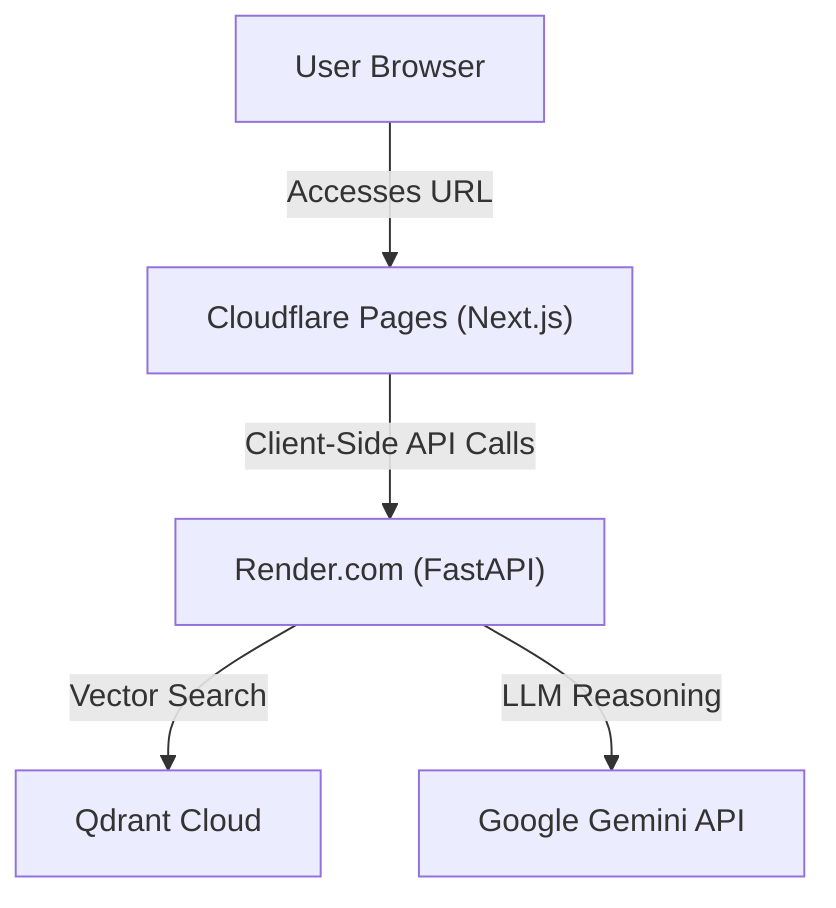

# Design Specification: Cloud Deployment and Gemini BYOK

This document specifies the design for migrating the **Kompare PC Builder** prototype from a purely local development environment to a cloud-ready deployment. It details the cloud architecture (Cloudflare Pages + Render + Qdrant Cloud) and the client-side Gemini API Key Override (Bring Your Own Key / BYOK) system.

## Context & Objectives

Kompare is currently a local-first PC builder prototype. To make it publicly accessible and testable without requiring local installation, we will:
1. Deploy the Next.js frontend to **Cloudflare Pages**.
2. Deploy the FastAPI backend to **Render (Free Tier)**.
3. Migrate the local Qdrant vector database to **Qdrant Cloud (Free Tier)**.
4. Implement a **Gemini API Key override (BYOK)** in the frontend to let users input their own Gemini API keys once the shared server quota is exhausted, while ensuring security by never persisting user keys on the server.
5. Retain a **Dual Mode** behavior: the app operates in **Cloud Mode** (Gemini + BYOK + Qdrant Cloud) when deployed, and retains **Local Mode** (LM Studio + local Qwen + local Qdrant) when run locally.

---

## Architectural Overview



### Deployment Targets
*   **Frontend**: Next.js App Router static/SSR build deployed on **Cloudflare Pages** (using the OpenNext adapter `@opennextjs/cloudflare` if SSR routes are needed, or static export if all dynamic features go through client-side API requests).
*   **Backend**: FastAPI application deployed on **Render (Free Tier)**.
*   **Vector Database**: Managed **Qdrant Cloud (Free Tier)** instance.

---

## Technical Design

### 1. Dual Mode System
The backend will select its operational profile using the `KOMPARE_AI_PROFILE` environment variable:
*   `gemini_free` (default for Cloud Deployment): Uses local JSON vectors or Qdrant Cloud vectors, and Gemini API for reasoning.
*   `local_qwen` (default for Local Dev): Uses local LM Studio (`localhost:1234`) and local Qdrant Docker (`localhost:6333`).

---

### 2. Gemini BYOK (Bring Your Own Key)

To protect the server's shared Gemini API quota, users can provide their own key in the UI.

#### Frontend Flow:
1. A **Settings Panel** (integrated into the retro shell/desktop UI) will allow the user to input a Gemini API Key.
2. The key will be stored securely in the browser's `localStorage` under `kompare_user_gemini_key`.
3. The UI will display a status pill:
    *   `Using Server Key` (default)
    *   `Using Personal Key` (when a key is present in `localStorage`)
4. An option to `Clear Key` will delete the key from `localStorage`.
5. All outbound API requests to `/build/recommend`, `/build/ai-recommend`, `/build/upgrade`, `/build/advisor`, and `/build/audit` will intercept the request and add the custom header `X-Gemini-Api-Key` if the key is present.

#### Backend Flow:
1. In `backend/app.py`, request handlers will accept an optional header: `x_gemini_api_key: Optional[str] = Header(None)`.
2. If `x_gemini_api_key` is present, it overrides the server-side environment variable `GEMINI_API_KEY` for that specific API request context.
3. The key is passed directly to the Gemini Client wrapper (`backend/gemini_client.py`) and is never logged or stored on the server filesystem.

---

### 3. Qdrant Cloud Integration

We will migrate vector queries from the local Docker instance to a managed Qdrant Cloud cluster.

#### Backend Changes (`backend/utils/qdrant_store.py`):
Update the `QdrantVectorStore` client initialization to accept an optional `api_key`. When connecting to Qdrant Cloud, both the HTTPS `url` and `api_key` are required:

```python
from qdrant_client import QdrantClient

self.client = QdrantClient(
    url=self.url,
    api_key=self.api_key,  # Read from environment/profile
)
```

#### Seeding to Cloud:
The seeding command `python -m backend.utils.qdrant_sync` will be updated to read `QDRANT_URL` and `QDRANT_API_KEY` from environment variables, allowing the catalog to be synced directly to the cloud cluster from local machines.

---

### 4. CORS and Cloud Security
*   The FastAPI backend will allow CORS requests originating from `https://*.pages.dev` and any registered custom domain.
*   The backend will be configured to handle preflight `OPTIONS` requests gracefully.

---

## Verification Plan

### Automated Tests
1.  **Backend Tests**:
    *   Add a test in `backend/tests/` to verify that `x-gemini-api-key` headers are correctly extracted and passed to the Gemini Client.
    *   Verify that missing headers fallback safely to the server's environment keys.
2.  **Frontend Tests**:
    *   Add a unit test in `frontend/tests/` to verify that the `api.js` request wrapper correctly attaches the `X-Gemini-Api-Key` header when `localStorage` has a value.

### Manual Verification
1.  **Local Test of Cloud Profile**:
    *   Run FastAPI locally with `KOMPARE_AI_PROFILE=gemini_free`.
    *   Supply an invalid/expired key in the settings panel and verify that API calls fail with a clear authorization warning.
    *   Supply a valid personal Gemini key in the settings panel and verify that recommendations succeed.
2.  **Qdrant Cloud Smoke Check**:
    *   Sync catalog to Qdrant Cloud using the sync tool.
    *   Run `qdrant_smoke.py` configured with the Qdrant Cloud URL and API key to verify connection and collection counts.
