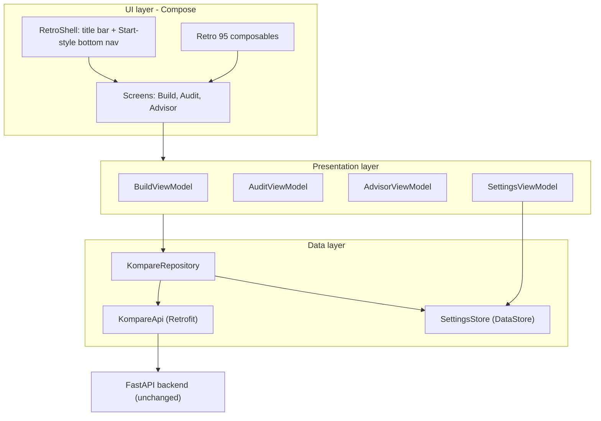
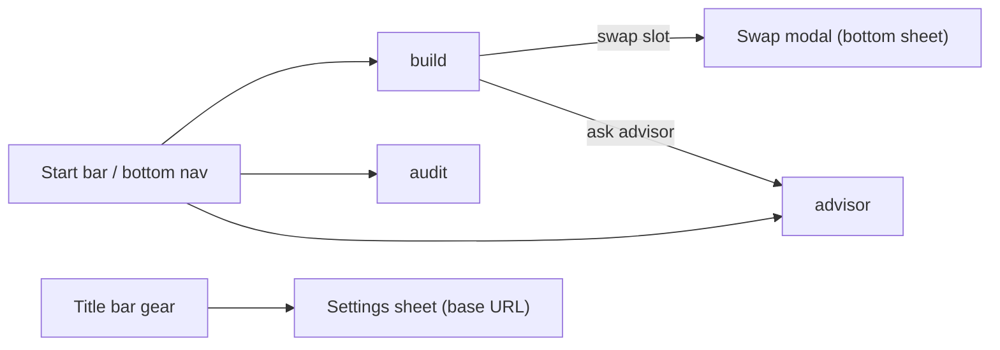

# 01 - Architecture

The mobile app follows a pragmatic, single-module **MVVM + Repository** architecture that
mirrors the data flows already proven in the web client. It is intentionally lean: one
Gradle module, Hilt for DI, Compose Navigation for routing, and `StateFlow`-driven
ViewModels.

## High-level layers



- **UI layer** - stateless Compose screens that render `UiState` and emit user intents.
- **Presentation layer** - ViewModels hold screen state in `StateFlow`, call the
  repository, and translate results/errors into `UiState`.
- **Data layer** - a single `KompareRepository` wraps the Retrofit `KompareApi` and the
  `SettingsStore` (DataStore for the configurable base URL). Network mapping/normalization
  lives here so ViewModels stay thin.

## Why MVVM (not MVI/Redux)

The web client already uses local component state per flow with a "request sequence" guard
to ignore stale responses (see `requestSequence` in
[`BuildWizard.jsx`](../../frontend/components/builder/BuildWizard.jsx)). MVVM with a single
`StateFlow<UiState>` per screen reproduces this 1:1 with minimal ceremony. A full MVI
framework would be over-engineering for three screens.

## UiState model

Each screen exposes one immutable state object. Async sections use a shared sealed result
that maps directly to the web `StatusPanel` tones (`idle` / `processing` / `success` /
`error`).

```kotlin
sealed interface Async<out T> {
    data object Idle : Async<Nothing>
    data object Loading : Async<Nothing>
    data class Success<T>(val data: T) : Async<T>
    data class Error(val message: String) : Async<Nothing>
}
```

Example screen state (Build):

```kotlin
data class BuildUiState(
    val form: BuildFormState = BuildFormState(),       // budget, useCase, brands, mode, allocation...
    val result: Async<BuildResponse> = Async.Idle,     // recommend / ai-recommend
    val swap: SwapUiState = SwapUiState(),             // open slot, candidates, loading
    val advisorVisible: Boolean = false,
)
```

## Stale-response guarding

Reproduce the web `requestSequence.current` pattern. Each ViewModel keeps an incrementing
request id (or cancels the previous `Job`). Use **`Job` cancellation** as the idiomatic
Kotlin approach: store the in-flight `Job`, cancel it before launching a new request, so
late responses never overwrite newer state.

```kotlin
private var buildJob: Job? = null

fun submitBuild() {
    buildJob?.cancel()
    buildJob = viewModelScope.launch {
        _state.update { it.copy(result = Async.Loading) }
        val outcome = runCatching { repository.recommend(form.toRequest()) }
        _state.update { it.copy(result = outcome.fold(::success, ::error)) }
    }
}
```

## Navigation

Compose Navigation with three top-level destinations plus a settings sheet. The retro
shell hosts a navy title bar at the top and a Windows-95 Start-style bar at the bottom that
doubles as the bottom navigation.



Routes:

| Route | Screen | Notes |
|---|---|---|
| `build` | `BuildScreen` | Default start destination; form + results + advisor toggle |
| `audit` | `AuditScreen` | Image picker + parts list |
| `advisor` | `AdvisorScreen` | Standalone advisor (also embeddable under Build) |
| `settings` (sheet) | `SettingsSheet` | Base URL editor + health check |

The Advisor is both a standalone destination and an embedded section under a build result
(matching the web, where `AdvisorConsole` renders inside `BuildWizard`). Share one
`AdvisorViewModel` keyed by the active build context so the conversation resets when the
build changes (the web uses `key={buildKey}` for this).

## Shared build context

The Advisor and Swap features both need the **active build** as context. Hold the latest
`BuildResponse` in a process-scoped holder so it survives navigation between Build and
Advisor destinations:

- Option A (recommended): a `@Singleton ActiveBuildHolder` (`MutableStateFlow<BuildResponse?>`)
  injected into the relevant ViewModels.
- Option B: pass a serialized build key via the nav back stack `SavedStateHandle`.

Use Option A; it cleanly mirrors the web's shared `build` object passed as `context` to the
advisor and swap calls.

## Package structure

Single module `:app`. Suggested package layout under `com.kompare.mobile`:

```
com.kompare.mobile
├── KompareApp.kt                  // @HiltAndroidApp
├── MainActivity.kt                // single activity, setContent { KompareTheme { AppRoot() } }
├── di/
│   ├── NetworkModule.kt           // OkHttp, Retrofit, KompareApi
│   └── AppModule.kt               // DataStore, repository bindings
├── data/
│   ├── remote/
│   │   ├── KompareApi.kt          // Retrofit interface
│   │   └── dto/                   // *Dto request/response models
│   ├── settings/
│   │   └── SettingsStore.kt       // DataStore base-url
│   ├── ActiveBuildHolder.kt
│   └── KompareRepository.kt
├── domain/
│   ├── model/                     // UI-facing models (Component, BuildResult, Audit, Advisor...)
│   └── slots/                     // Slot order, labels, spec formatting (port of slots.js)
├── ui/
│   ├── theme/                     // Color.kt, Type.kt, Theme.kt, Dimens.kt
│   ├── retro/                     // Bevel modifiers + RetroButton/Input/Select/Panel/Window
│   ├── shell/                     // RetroShell, TitleBar, StartBar (bottom nav)
│   ├── build/                     // BuildScreen, BuildViewModel, BuildFormState, components
│   ├── swap/                      // SwapSheet, SwapViewModel
│   ├── audit/                     // AuditScreen, AuditViewModel
│   ├── advisor/                   // AdvisorScreen/Console, AdvisorViewModel
│   ├── settings/                  // SettingsSheet, SettingsViewModel
│   └── common/                    // StatusPanel, IDR formatting composables, error mapping
└── util/                          // money (formatIDR/parseIDR), result helpers
```

## Threading & lifecycle

- All network calls run on `Dispatchers.IO` via Retrofit `suspend` functions.
- ViewModels expose `StateFlow`; screens collect with `collectAsStateWithLifecycle()`.
- The base URL is read from DataStore at app start; changing it rebuilds the OkHttp
  `baseUrl` (see [03-api-integration](03-api-integration.md) for the dynamic base-URL
  interceptor approach so Retrofit need not be recreated).

## Error strategy

A single `ApiError` (mirroring the web `ApiError` class in
[`api.js`](../../frontend/lib/api.js)) carries an HTTP status + a user-facing message.
The repository maps exceptions (`IOException`, `HttpException`, timeouts) into friendly
strings that the screens render in an error `StatusPanel`, exactly like the web flows.
Details in [03-api-integration](03-api-integration.md).
