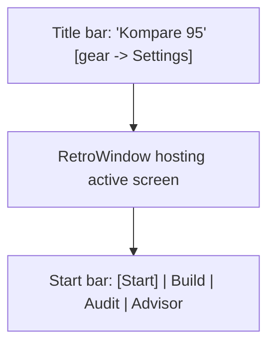

# 05 - Design System (Retro "Kompare 95" for Mobile)

This translates the Windows-95 look from
[`frontend/styles/kompare95.css`](../../frontend/styles/kompare95.css) and
[`design/DESIGN.md`](../../design/DESIGN.md) into a Compose design system. The goal is a
**touch-first** retro UI: teal desktop, gray beveled panels, navy title bars, pixel
typography, chunky 3D buttons.

## Color tokens

Ported from the CSS `:root` variables.

```kotlin
object Retro {
    val DesktopTeal = Color(0xFF008080)   // --desktop-teal (app background)
    val Silver      = Color(0xFFC0C0C0)   // --win95-silver (surfaces/panels)
    val Light       = Color(0xFFFFFFFF)   // --win95-light (top-left bevel highlight)
    val Mid         = Color(0xFFDFDFDF)   // --win95-mid
    val Dark        = Color(0xFF808080)   // --win95-dark (bottom-right bevel shadow)
    val Black       = Color(0xFF000000)   // --win95-black (hard outline)
    val Navy        = Color(0xFF000080)   // --win95-navy (title bars)
    val Focus       = Color(0xFFFFFF00)   // --win95-focus (focus outline)
    val Success     = Color(0xFF16A34A)   // --win95-success
    val Warning     = Color(0xFFD97706)   // --win95-warning
    val Danger      = Color(0xFFDC2626)   // danger (DESIGN.md)
    val TitleText   = Color(0xFFFFFFFF)
}
```

Map into a Material3 `ColorScheme` (so M3 components inherit sensible defaults) but rely on
the retro composables for the actual look:

```kotlin
private val KompareColorScheme = lightColorScheme(
    primary = Retro.Navy,
    onPrimary = Retro.TitleText,
    background = Retro.DesktopTeal,
    surface = Retro.Silver,
    onSurface = Retro.Black,
    error = Retro.Danger,
)
```

## Typography

Per [`design/DESIGN.md`](../../design/DESIGN.md): display/headings in **Silkscreen**,
labels in **JetBrains Mono**. The live CSS falls back to MS Sans Serif / Courier New, which
don't exist on Android, so bundle the two OFL fonts in `res/font/`.

```kotlin
val Silkscreen = FontFamily(
    Font(R.font.silkscreen_regular, FontWeight.Normal),
    Font(R.font.silkscreen_bold, FontWeight.Bold),
)
val JetBrainsMono = FontFamily(
    Font(R.font.jetbrains_mono_regular, FontWeight.Normal),
    Font(R.font.jetbrains_mono_bold, FontWeight.Bold),
)

// Scale from DESIGN.md: 12/14/16/20/24/32
val KompareTypography = Typography(
    headlineLarge = TextStyle(fontFamily = Silkscreen, fontWeight = FontWeight.Bold, fontSize = 24.sp),
    headlineMedium = TextStyle(fontFamily = Silkscreen, fontWeight = FontWeight.Bold, fontSize = 20.sp),
    titleMedium = TextStyle(fontFamily = Silkscreen, fontWeight = FontWeight.Bold, fontSize = 16.sp),
    bodyMedium = TextStyle(fontFamily = JetBrainsMono, fontSize = 14.sp),
    bodySmall = TextStyle(fontFamily = JetBrainsMono, fontSize = 12.sp),
    labelSmall = TextStyle(fontFamily = JetBrainsMono, fontWeight = FontWeight.Bold, fontSize = 12.sp, letterSpacing = 0.5.sp),
)
```

> Pixel fonts can be cramped at small sizes; keep buttons/inputs at >= 14sp for tap targets
> and legibility. Use Silkscreen sparingly for headers/title bars, JetBrains Mono for body.

## Spacing & shape

```kotlin
object Dimens {
    val xs = 4.dp; val sm = 8.dp; val md = 12.dp; val lg = 16.dp; val xl = 24.dp; val xxl = 32.dp
    val bevel = 2.dp            // bevel thickness
    val outline = 2.dp          // hard black outline
    val titleBar = 28.dp
    val startBar = 48.dp        // bottom Start-style nav height (touch-friendly)
    val minTouch = 48.dp
}
// Win95 is square: no rounded corners.
val RetroShapes = Shapes(small = RectangleShape, medium = RectangleShape, large = RectangleShape)
```

## The bevel system (core of the look)

Windows 95 widgets are gray rectangles with a light top-left highlight and dark
bottom-right shadow (raised), inverted when pressed/sunken. The CSS uses nested
`box-shadow: inset` layers (see `.desktop-icon-glyph` and button rules in the CSS). Recreate
with a custom `Modifier.drawWithContent` that paints four bevel edges over a black outline.

```kotlin
enum class Bevel { Raised, Sunken }

fun Modifier.beveled(
    style: Bevel = Bevel.Raised,
    surface: Color = Retro.Silver,
    thickness: Dp = Dimens.bevel,
    outline: Boolean = true,
): Modifier = this
    .background(surface)
    .drawWithContent {
        drawContent()
        val t = thickness.toPx()
        val w = size.width; val h = size.height
        val topLeft = if (style == Bevel.Raised) Retro.Light else Retro.Dark
        val bottomRight = if (style == Bevel.Raised) Retro.Dark else Retro.Light
        // outer top & left
        drawRect(topLeft, size = Size(w, t))                          // top
        drawRect(topLeft, size = Size(t, h))                          // left
        // outer bottom & right
        drawRect(bottomRight, topLeft = Offset(0f, h - t), size = Size(w, t))   // bottom
        drawRect(bottomRight, topLeft = Offset(w - t, 0f), size = Size(t, h))   // right
        if (outline) {
            drawRect(Retro.Black, style = Stroke(width = 1f))         // hard outline
        }
    }
```

> Implementation detail: a faithful Win95 bevel uses **two** rings (outer light/dark +
> inner mid/black). Provide an optional `doubleBevel` variant for buttons/panels to match
> the CSS's layered `inset` shadows. Keep a single `beveled()` for v1 simplicity and add the
> inner ring if it reads too flat.

## Reusable composables

These mirror the web's `FormControls.jsx`, `StatusPanel.jsx`, and `RetroWindow.jsx`.

### RetroWindow (window chrome)

A panel with a navy title bar + content area. Each screen is hosted in one.

```kotlin
@Composable
fun RetroWindow(title: String, modifier: Modifier = Modifier, content: @Composable ColumnScope.() -> Unit) {
    Column(modifier.beveled(Bevel.Raised)) {
        Row(
            Modifier.fillMaxWidth().background(Retro.Navy).padding(horizontal = Dimens.sm, vertical = Dimens.xs),
            verticalAlignment = Alignment.CenterVertically,
        ) {
            Text(title, color = Retro.TitleText, style = MaterialTheme.typography.labelSmall, modifier = Modifier.weight(1f))
            // optional window control glyphs (_ [] X) as non-functional decoration or real actions
        }
        Column(Modifier.padding(Dimens.md), content = content)
    }
}
```

### RetroButton

Raised bevel by default; switches to sunken while pressed (use `interactionSource`). Shows a
spinner/disabled state for `loading` like the web `RetroButton`.

```kotlin
@Composable
fun RetroButton(text: String, onClick: () -> Unit, enabled: Boolean = true, loading: Boolean = false, secondary: Boolean = false) {
    val interaction = remember { MutableInteractionSource() }
    val pressed by interaction.collectIsPressedAsState()
    val style = if (pressed) Bevel.Sunken else Bevel.Raised
    Box(
        Modifier
            .defaultMinSize(minHeight = Dimens.minTouch)
            .beveled(style, surface = if (secondary) Retro.Mid else Retro.Silver)
            .clickable(interaction, indication = null, enabled = enabled && !loading) { onClick() }
            .padding(horizontal = Dimens.lg, vertical = Dimens.sm),
        contentAlignment = Alignment.Center,
    ) {
        if (loading) RetroSpinner() else Text(text, style = MaterialTheme.typography.labelSmall, color = if (enabled) Retro.Black else Retro.Dark)
    }
}
```

### RetroInput / RetroTextarea

Sunken bevel field (white fill) with a label above. Wrap `BasicTextField` to keep full
visual control; cursor color = black.

```kotlin
@Composable
fun RetroInput(label: String, value: String, onValueChange: (String) -> Unit, keyboardType: KeyboardType = KeyboardType.Text, placeholder: String = "") { /* label + BasicTextField on white .beveled(Sunken) */ }
```

### RetroSelect

Win95 dropdowns are a sunken field + a raised down-arrow button. On mobile, back it with a
Material3 `DropdownMenu`/`ExposedDropdownMenuBox` styled with bevels, or a bottom-sheet
picker for long lists. Render the chosen option in a sunken field.

### RetroCheckbox / RetroRadio

Square sunken box with a black check/dot; label to the right. Used for optional add-ons,
recommendation mode (radio), and advanced allocation toggle.

### StatusPanel

Port `StatusPanel.jsx` tones to a beveled banner with an accent stripe:

| Tone | Accent | Use |
|---|---|---|
| `idle` | Navy | advisor ready, neutral info |
| `processing` | Navy + animated bar | building / auditing |
| `success` | `Retro.Success` | build ready / audit ok |
| `warning` | `Retro.Warning` | audit has issues |
| `error` | `Retro.Danger` | request failed |

```kotlin
@Composable
fun StatusPanel(tone: Tone, title: String, message: String) { /* beveled box, colored left stripe, Silkscreen title + mono message */ }
```

### SpecPill & PartRow

- `SpecPill`: tiny beveled chip showing `label` (bold) + `value` (see `specPills` in
  [04-data-models](04-data-models.md)).
- `PartRow`: slot label + component name/brand + spec pills + price + Swap button, the
  building block of the results list (web `.part-row`). Support a `highlighted` state (web
  `is-referenced`) drawn with the yellow focus color when the advisor references a slot.

## Desktop background & shell

- App background: `Retro.DesktopTeal` with a faint grid drawn via a tiling `Brush`
  (matches the CSS `background-image` 24px grid) - no bitmap needed.
- **Title bar** (top): navy bar with "Kompare 95" + a gear glyph that opens Settings.
- **Start bar** (bottom): a raised beveled bar acting as bottom navigation. A "Start"-style
  button on the left (optional) and three tabs: Build / Audit / Advisor. The active tab
  renders sunken. Height = `Dimens.startBar` for comfortable tapping.



## Accessibility

- Maintain >= 48dp touch targets despite the dense retro look.
- Provide `contentDescription` for icon-only controls (gear, swap, window glyphs),
  mirroring the web's `aria-label`s (e.g. "Swap processor", "View at EnterKomputer - ...").
- Keep text contrast high: black on silver/white; white on navy. The yellow focus color is
  for highlight accents only, not body text.
- Respect large font scaling; pixel fonts must still wrap (the CSS uses
  `overflow-wrap: anywhere`).

## Theme entry point

```kotlin
@Composable
fun KompareTheme(content: @Composable () -> Unit) {
    MaterialTheme(
        colorScheme = KompareColorScheme,
        typography = KompareTypography,
        shapes = RetroShapes,
        content = content,
    )
}
```
