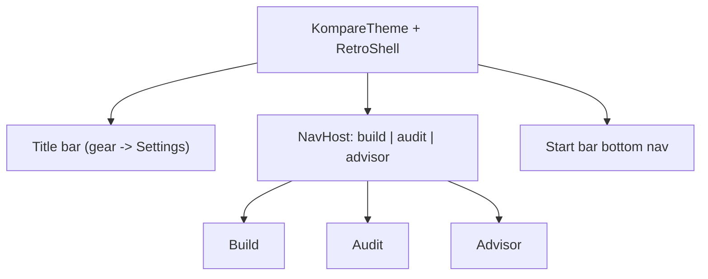
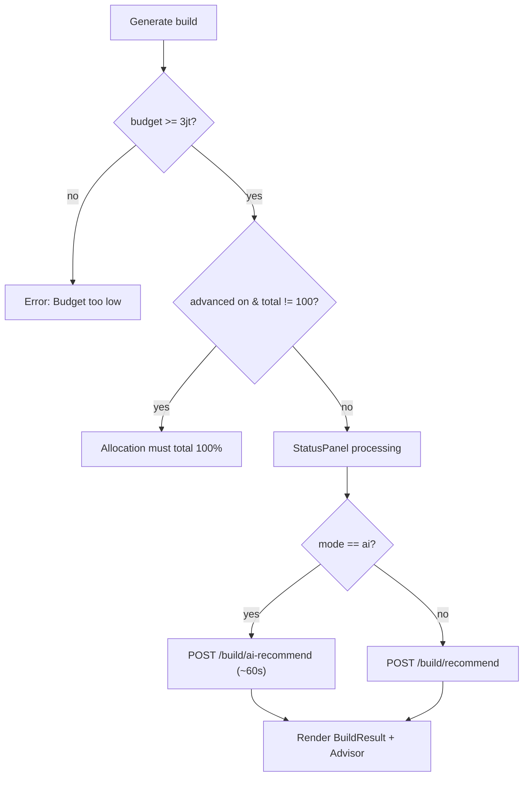
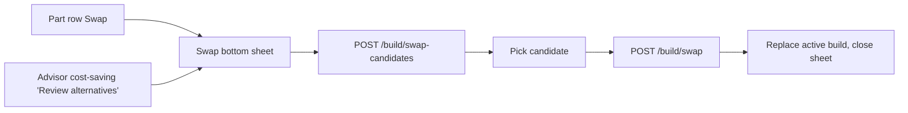
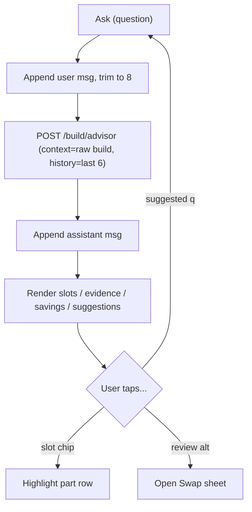

# 06 - Screens & Flows

Per-screen UX for the v1 core trio plus the Swap modal and Settings sheet. Each screen maps
directly to a web component; behaviors (validation, loading copy, fallbacks) are matched to
the reference so the mobile app behaves identically.

Navigation recap (from [01-architecture](01-architecture.md)): bottom Start-style bar
switches between **Build**, **Audit**, **Advisor**; the title-bar gear opens **Settings**.
The advisor also appears embedded under a fresh build result.

## Global app frame

---

## 1. Build screen

Reference: [`BuildWizard.jsx`](../../frontend/components/builder/BuildWizard.jsx) +
[`BuildResults.jsx`](../../frontend/components/results/BuildResults.jsx).

### Layout (scrollable, single column)

1. **Build form** (`RetroWindow` "Build From Zero")
2. **Status panel** (processing / error / success)
3. **Build results** (summary + part list + optional add-ons)
4. **Advisor console** (embedded once a build exists)

### Form fields

| Field | Control | Values / notes |
|---|---|---|
| Budget (IDR) | `RetroInput` numeric | Parsed via `parseIdr`; placeholder `20.000.000`; min Rp 3,000,000 |
| Use case | `RetroSelect` | gaming, productivity, content_creation, office, student |
| CPU | `RetroSelect` | Any / AMD / Intel (soft preference) |
| GPU | `RetroSelect` | Any / Nvidia / AMD Radeon / Intel Arc |
| Budget strategy | `RetroSelect` | value, balanced, maximize |
| Performance priority | `RetroSelect` | gaming, productivity, best_value, balanced, upgrade_friendly |
| Use advanced allocation | `RetroCheckbox` | Reveals allocation panel |
| Recommendation mode | `RetroRadio` group | `fast` (deterministic) / `ai` (AI-assisted) |
| AI profile | `RetroSelect` (only when mode=ai) | local_qwen, gemini_free |
| Optional add-ons | `RetroCheckbox` x3 | hdd, monitor, ups |
| Generate build | `RetroButton` (submit) | Disabled while loading |

### Advanced allocation panel

Mirrors the slider grid in `BuildWizard.jsx`:
- Nine slots: cpu, gpu, ram, motherboard, ssd, psu, case, cpu_cooler, fan_cooler.
- Each row: label + slider (0-60) + number field (0-100) + `%`.
- Live **total** indicator; valid only at **100%**.
- "Suggested by: {useCase} + {strategy} + {priority}" label; a **Reset allocation** button.
- When use case/strategy/priority changes while in *custom* mode, show an "Apply suggested
  allocation" affordance (web `pendingSuggestedAllocation`).
- Compute suggested profiles locally with the ported `suggestedAllocationProfile` logic
  (use-case profile -> priority shift -> strategy shift -> normalize to 100). Seed from
  `/build/allocation-presets`; fall back to the local metadata table
  (`LOCAL_ALLOCATION_PRESET_METADATA`) if the call fails.

### Submit logic

- Loading copy by mode (web `LOADING_STATUS`):
  - ai: title "AI BUILD IN PROGRESS", message about ranking catalog candidates (~a minute).
  - fast: title "GENERATING", message "Building a compatible parts list."
- On success: "BUILD READY - Generated for {formatIdr(budget)}."
- Use **Job cancellation** to drop stale responses (the web `requestSequence`).
- Store the **raw** response JSON as the active build (`ActiveBuildHolder`) for advisor/swap.

### Results rendering

- **Summary panel**: big `total_idr`; Budget + Remaining (or "Over budget" when negative);
  markers row: "AI-assisted" and/or `fallbackLabel(reason)` when applicable.
- **Budget guidance** (if present): usage `% used` + strategy/target; budget warnings;
  top 3 recommended upgrades; performance balance summary.
- **Compatibility warnings** and legacy **compatibility issues** lists.
- **Part list** in `Slots.ORDER`: each row shows label, name, brand, spec pills (max 4),
  "View at EnterKomputer" link (opens externally via `Intent`), price, and a **Swap** button.
  Empty slots render "No recommendation".
- **Optional add-ons** section in `OPTIONAL_ADDON_ORDER`, filtered to the user's submitted
  selections; labeled as separate from the core tower total.
- A part row highlights (yellow focus) when the advisor references its slot.

---

## 2. Swap modal

Reference: [`SwapModal.jsx`](../../frontend/components/swap/SwapModal.jsx) (and
`/build/swap-candidates`, `/build/swap`). Presented as a **bottom sheet** (`ModalBottomSheet`
styled retro) opened from a part row's Swap button or from an advisor cost-saving suggestion.

State / inputs:
- `slot`, `currentSku`, optional `preferredSku` (from advisor suggestion),
  `budgetIdr`, `useCase`, and the current `components` map.

Flow:
1. On open, `POST /build/swap-candidates` with the current build map; show a list of
   candidates sorted as the backend returns (closest price delta first).
2. Optional search box (`q`) and a max-price filter; re-query on change (debounced).
3. Each candidate card: name, spec pills, price, **price delta** vs current, projected
   total/remaining, and a `compatibility_summary` + any warnings.
4. Selecting a candidate calls `POST /build/swap` with `new_component_id`; the returned full
   build replaces the active build (raw + typed), the sheet closes, and the part list
   re-renders with updated totals and compatibility.

---

## 3. Audit screen

Reference: [`BuildAudit.jsx`](../../frontend/components/audit/BuildAudit.jsx) +
`/build/audit`.

### Form

| Field | Control | Notes |
|---|---|---|
| Cart screenshot | image picker button + preview | Photo Picker; show thumbnail via Coil; clearable |
| Build goal | `RetroSelect` | General Gaming, Esports/FPS, 1080p, 1440p, Content Creation, Office/Student |
| Parts list | `RetroTextarea` (6 rows) | placeholder `CPU: Ryzen 5 5600\nGPU: RTX 3060 12GB` |
| Audit build | `RetroButton` submit | Requires image OR non-empty parts list |

### Submit & results

- Validation: if neither image nor parts list, error "Paste a parts list or upload a cart
  screenshot first." (matches backend 400).
- Loading: StatusPanel "AUDITING - Checking detected parts, compatibility, and missing
  build details."
- Multipart upload per [03-api-integration](03-api-integration.md); unwrap `audit`.
- Result sections (normalize list-or-object shapes):
  - **Status banner**: tone = warning if any compatibility issues else success; title =
    status (e.g. "NEEDS ATTENTION"); message = `summary`.
  - **Detected parts**: rows with slot label, name, confidence (`x% confidence`), source,
    and spec pills.
  - **Compatibility issues**: severity + title + message + recommendation.
  - **Missing slots**, **Budget notes**, **Next steps** lists.
- **Apply detected parts** button: the web routes detected parts to the Upgrade flow. Since
  Upgrade is out of scope in v1, **hide this button** (or show it disabled with a "Upgrade
  planner coming soon" note). Document this as the one intentional deviation from the web.

> Backend behavior note: if an image is uploaded but the multimodal model is unavailable,
> the backend returns guidance to paste parts as text. Surface that summary/next-steps as-is.

---

## 4. Advisor screen / console

Reference: [`AdvisorConsole.jsx`](../../frontend/components/advisor/AdvisorConsole.jsx) +
`/build/advisor`. Appears both embedded under a build result and as a standalone tab.

### Context requirement

The advisor needs an **active build** as `context`. If none exists (standalone tab opened
before any build), show an idle StatusPanel: "Generate a build first, then ask the advisor."
Otherwise use the raw active build JSON as `context`.

### Conversation behavior (client-owned memory)

- Keep last **8** messages in UI; send last **6** to the API as `history`
  (`MAX_HISTORY_MESSAGES` / `MAX_API_HISTORY`).
- Roles `user` / `assistant`. `mode` is `"build"` for v1.
- Reset the thread when the active build changes (web `key={buildKey}`); achieve this by
  keying the `AdvisorViewModel`/state on a build identity hash.

### Message rendering

Each assistant message can include:
- **answer** text; a "LOCAL FALLBACK" badge when `fallback` is true.
- **Referenced slots**: chips (short `Slots.ICONS` tokens) that, when tapped, scroll/
  highlight the corresponding part row in the build results (embedded case) - emit a
  `onReferenceSlot(slot)` event up to the Build screen.
- **Evidence used**: cards with label, price, name, brand, spec list, and rationale bullets.
- **Cost-saving swaps**: cards with candidate-vs-current, savings, projected total/remaining,
  compatibility summary, and a "Review alternatives for {slot}" button that opens the Swap
  sheet preset to that slot/candidate.
- **Suggested questions**: tappable chips that immediately ask that question.

### Input

- `RetroTextarea` (3 rows) + **Ask** button (disabled when blank or loading).
- On send: append user message, call `/build/advisor`, append assistant message, handle
  errors with an "ADVISOR FAILED" StatusPanel.

---

## 5. Settings sheet

Opened from the title-bar gear. Reference: the configurable base URL decision.

- `RetroInput` for **Base URL** (default `http://10.0.2.2:8000`), persisted to DataStore.
- **Test connection** button: calls `GET /health`; on success show
  "OK - {components_loaded} components, v{version}"; on failure show the mapped error.
- Helper text: emulator uses `10.0.2.2`; physical device uses the host LAN IP; cleartext
  http to dev hosts requires the debug network-security config
  (see [02-tech-stack](02-tech-stack.md)).

---

## State summary per screen

| Screen | ViewModel state | Async calls |
|---|---|---|
| Build | form fields, allocation, `Async<BuildResult>`, submitted add-ons, highlighted slot | recommend / ai-recommend, allocation-presets (init) |
| Swap | slot, query, maxPrice, `Async<List<candidate>>`, swapping flag | swap-candidates, swap |
| Audit | imageUri, goal, partsList, `Async<Audit>` | audit (multipart) |
| Advisor | messages, input, loading, error, active build context | advisor |
| Settings | baseUrl, `Async<Health>` | health |

## Intentional deviations from web (v1)

1. **Upgrade flow removed** - "Apply detected parts" in Audit is hidden/disabled (no Upgrade
   destination yet).
2. **Desktop window manager** (draggable/resizable windows, taskbar, multiple open windows)
   is replaced by a single-window-at-a-time mobile shell with bottom-tab navigation.
3. **Marketplace links** open the system browser via `Intent` instead of a new tab.
