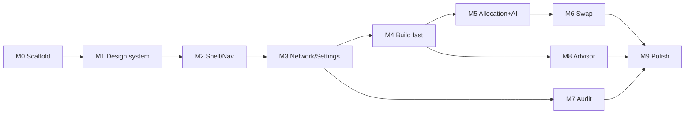

# 07 - Implementation Roadmap

A phased build sequence for the Compose app, each phase shippable/testable on its own. Every
phase references the relevant doc. Backend stays unchanged throughout.

## Milestones

### M0 - Project scaffold
- Create the Android Studio project: single `:app` module, Kotlin 2.0+, Compose enabled,
  Gradle version catalog (`libs.versions.toml`).
- Add dependencies from [02-tech-stack](02-tech-stack.md): Compose BOM, Material3,
  Navigation, Lifecycle, Hilt, Retrofit/OkHttp, kotlinx.serialization, DataStore, Coil.
- Apply plugins: Kotlin Compose, serialization, Hilt, KSP.
- `KompareApp` (`@HiltAndroidApp`), `MainActivity` with `setContent { KompareTheme { } }`.
- Debug `network_security_config.xml` allowing cleartext to `10.0.2.2` (+ LAN dev hosts).
- **Done when**: app builds and shows an empty teal screen.

### M1 - Design system
- Bundle Silkscreen + JetBrains Mono fonts in `res/font/`.
- Implement `Retro` colors, `KompareTypography`, `Dimens`, `RetroShapes`, `KompareTheme`
  (see [05-design-system](05-design-system.md)).
- Build `Modifier.beveled`, `RetroWindow`, `RetroButton`, `RetroInput`, `RetroTextarea`,
  `RetroSelect`, `RetroCheckbox`, `RetroRadio`, `StatusPanel`, `SpecPill`, `PartRow`.
- Compose previews for each composable in raised/sunken/disabled/loading states.
- **Done when**: a preview gallery renders the full retro widget set.

### M2 - App shell & navigation
- `RetroShell`: teal grid background, navy title bar (with Settings gear), bottom Start-bar
  nav (Build / Audit / Advisor).
- `NavHost` with the three routes + Settings as a modal sheet.
- **Done when**: tabs switch between three placeholder screens; gear opens Settings sheet.

### M3 - Networking & settings
- DTOs from [04-data-models](04-data-models.md); tolerant `Json` config.
- `SettingsStore` (DataStore base URL), `BaseUrlInterceptor`, `NetworkModule`, `KompareApi`,
  `KompareRepository` with `safeCall` error mapping.
- Settings sheet wired to `GET /health` (Test connection).
- **Done when**: Test connection succeeds against a locally running backend from the emulator.

### M4 - Build screen (fast mode)
- `BuildViewModel` + `BuildFormState`; form controls and validation (min Rp 3jt).
- `POST /build/recommend`; map to `BuildResult`; render summary, budget guidance, part list,
  optional add-ons; external marketplace links.
- Job-cancellation stale-response guard; loading/success/error StatusPanels.
- Store raw build in `ActiveBuildHolder`.
- **Done when**: a budget produces a rendered, compatible build.

### M5 - Advanced allocation + AI mode
- Allocation panel (sliders/number fields, total=100 validation, suggested vs custom,
  apply-pending), seeded from `/build/allocation-presets` with local fallback.
- Recommendation mode radio + AI profile select; `POST /build/ai-recommend` with the long
  (~120s) timeout and "AI BUILD IN PROGRESS" state; render AI-assisted / fallback markers.
- **Done when**: AI builds render and fallbacks are labeled correctly.

### M6 - Swap
- `SwapViewModel`; Swap bottom sheet from part rows.
- `POST /build/swap-candidates` (search + max-price filters), `POST /build/swap`; replace
  active build on selection.
- **Done when**: a slot can be swapped and totals/compatibility update.

### M7 - Audit
- `AuditViewModel`; Photo Picker + Coil preview, goal select, parts textarea.
- Multipart `POST /build/audit`; normalize list-or-object results; render all sections.
- Hide/disable "Apply detected parts" (Upgrade out of scope).
- **Done when**: image and/or text audit returns and renders detected parts + issues.

### M8 - Advisor
- `AdvisorViewModel` keyed to active build; client-owned memory (8 UI / 6 API turns).
- `POST /build/advisor`; render answer, referenced-slot chips, evidence cards, cost-saving
  cards (with "Review alternatives" -> Swap sheet), suggested-question chips.
- Slot chips highlight part rows in the embedded build view.
- **Done when**: multi-turn advisor works and cross-links into Swap + results highlight.

### M9 - Polish & hardening
- Empty/edge states, large-font and small-screen checks, accessibility content
  descriptions, error copy parity with web, app icon, retro splash.
- Optional: cache last build across process death (persist raw JSON).
- **Done when**: flows are robust on a clean install and across config changes.

## Testing approach

| Layer | What | Tools |
|---|---|---|
| Money/slots utils | `formatIdr`/`parseIdr` (incl. `jt`/`juta`), `specLabel`/`formatSpecValue`, `specPills`, allocation normalization to 100 | JUnit |
| JSON mapping | flat vs `recommendation`-wrapped builds; list-or-object audit normalizers; fallback label/flag logic; tolerant parsing of unknown keys | JUnit + sample fixtures captured from the live backend |
| Repository | error mapping (`HttpException`/timeout/IO -> friendly text); multipart assembly | MockWebserver |
| ViewModel | stale-response cancellation; validation (min budget, allocation != 100); state transitions Idle->Loading->Success/Error | coroutines-test + Turbine |
| UI | form submit enables/disables; results render part rows; advisor chips highlight rows; swap updates totals | Compose UI tests |

Capture real JSON fixtures by hitting each endpoint once (`/build/recommend`,
`/build/ai-recommend`, `/build/swap-candidates`, `/build/swap`, `/build/audit`,
`/build/advisor`) so DTO tests reflect actual backend shapes.

## Definition of done (v1)

- Build (fast + AI), Swap, Audit (image + text), and Advisor all function end-to-end
  against the FastAPI backend via a configurable base URL.
- Retro "Kompare 95" look applied consistently (bevels, navy title bars, pixel fonts, teal
  desktop, Start-bar nav).
- Error/loading/empty states match the web copy and tone.
- Parity gaps limited to the documented deviations (no Upgrade flow, single-window mobile
  shell, external browser links).

## Open questions / future work

1. **Upgrade flow** - the backend `POST /build/upgrade` exists and is fully functional even
   though the web `UpgradePlanner` is a stub. A future milestone could add an Upgrade screen
   and re-enable "Apply detected parts" from Audit.
2. **Backend hosting** - v1 targets local/LAN dev. For distribution, decide on a hosted
   HTTPS backend and bake a production default base URL (removes the cleartext exception).
3. **Component browser** - the web exposes `GET /components`; not in v1 scope but useful for
   a manual catalog browse/search screen.
4. **Offline/caching** - currently online-only. Consider caching the last build and form
   metadata for resilience.
5. **Auth** - the backend is currently unauthenticated; if a hosted deployment adds auth,
   the networking layer needs a token interceptor.
6. **AI latency UX** - consider cancellation UI for the ~60s AI build and a tip about the
   deterministic fast mode as an alternative.
